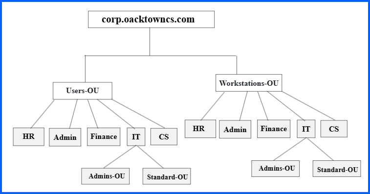
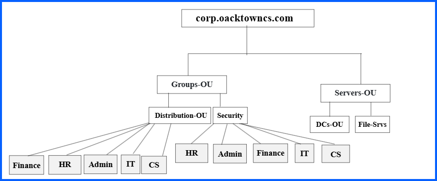

# 03 – Design Organizational Unit (OU) Structure

This document outlines the **Organizational Unit (OU) design** for the Active Directory environment of **Oak Town Corporate Services**.

The OU structure is designed to:

- Organize Active Directory objects logically
- Reflect the company’s departmental structure
- Simplify Group Policy management

## Reference OU Design

The domain is **corp.oaktowncs.com**
Company name is: Oak Town Corporate Services

# Company Departments

The simulated organization includes the following departments:

- Human Resources (HR)
- Finance
- Information Technology (IT)
- Administration (Admin)
- Customer Service (CS)

These departments are used to structure **users, computers, and groups** within Active Directory.

**Note:**  
CS = Customer Service  
Admin = Administration

---

# OU Design Strategy

The OU structure separates Active Directory objects by **type and function**. The main categories are:
- Users
- Computers
- Groups
- Servers
- Disabled Objects

---

# Users OU

The **Users-OU** will contains all user accounts within the organization.

Users are separated by department to make it easier to:
- Apply department-specific Group Policies
- Manage permissions

The IT department includes two additional sub-OUs:
- **Admins-OU** – For privileged IT tasks
- **Standard-OU** – for regular IT tasks

---

# Workstations OU

The **Workstations-OU** contains workstation objects for employees.

Each department has its own OU so that policies such as:
- Security policies
- Software deployment
- Desktop configuration
- Windows updates

can be applied based on department.

IT computers are further divided into:

- **Admins-OU**
- **Standard-OU**

This supports different configurations for administrative workstations.

---

# Groups OU

The **Groups-OU** contains Active Directory groups used for permissions and communication.

Two types of groups are used:

### Security Groups

Will be used to assign permissions to:

- File shares
- Applications
- Network resources

Security groups are organized by department.

