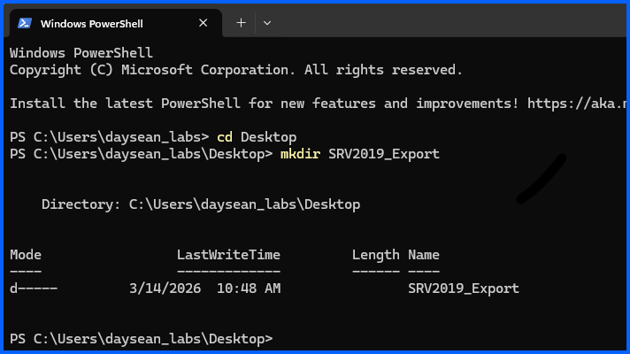
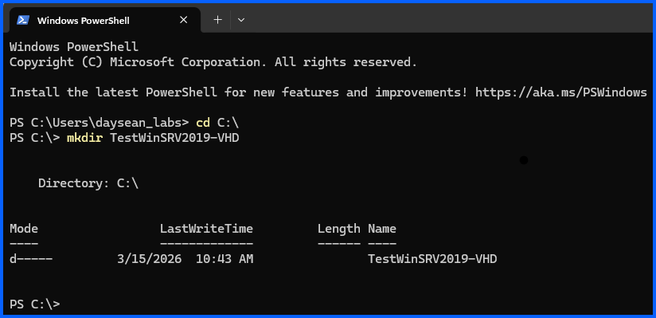

# 01 – Clone Production Server to Create Test Environment

## Overview

Before implementing changes in the production Active Directory environment, I will create a **test environment** to safely validate configurations and administrative tasks.

In this phase, I will the **export and import** production server virtual machine using Hyper-V. The cloned virtual machine serves as a **test Server / Domain controller** where changes can be evaluated before applying them to the production server.

---

## Environment Context

Production Server VM: **Windows-2019-SRV**

Test Server VM: **TST-AD-SRV**

The test server will be used for:

- Configuration testing
- Active Directory experiments
- Group Policy validation
- Administrative tasks testing
- Automation tests

---

### Step 1 – Create Export Folder for VM

Open **PowerShell** and create a directory where the exported virtual machine will be stored.

Navigate to the Desktop:

```powershell
cd Desktop
```

Create the export folder:

```powershell
mkdir SRV2019_Export
```

This folder will store the exported VM files.



### Step 2 – Create VHD Folder for Test Server

Create a folder to store the virtual hard disk for the cloned server.

Navigate to the C drive:

```powershell
cd C:\
```

Create the VHD directory:

```powershell
mkdir TestWinSRV2019-VHD
```

This folder will store the virtual hard disk files for the test server..



### Step 3 – Export Production Virtual Machine

Open Hyper-V Manager.

Locate the production virtual machine: **Windows-2019-SRV**


